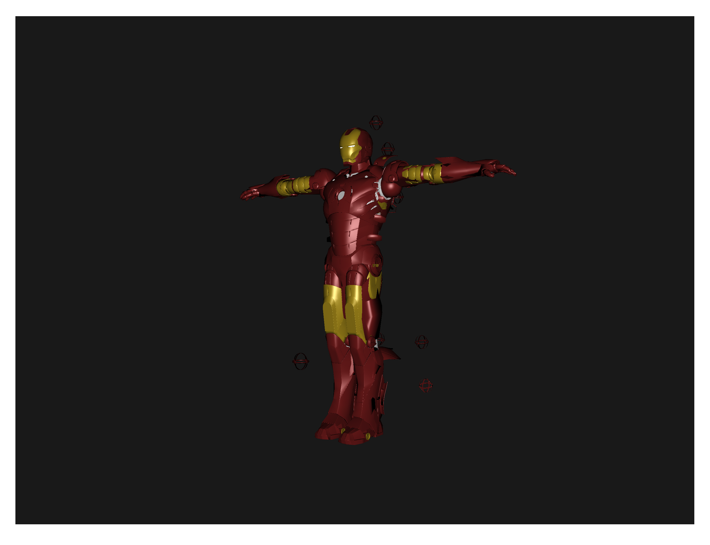
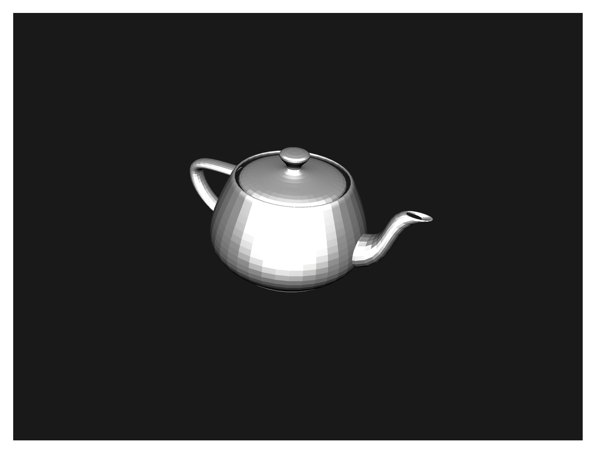

# Scop

Small project for learning basics of modern OpenGL.
Just loading OBJ models and working with textures and materials.




## Usage

Libraries needed for OpenGL : 
```
brew install glew
brew install glfw
```
Compilation :
```
make -C build
```
Launching :
```
./build/scop [model file]
```

## References
* [OpenGL tutoial](http://www.opengl-tutorial.org/ru/)
* [Another OpenGL tutorial](https://habr.com/en/post/310790/)
* [Tutorials on matrices and grapichs in general](https://www.scratchapixel.com/index.php?redirect)
