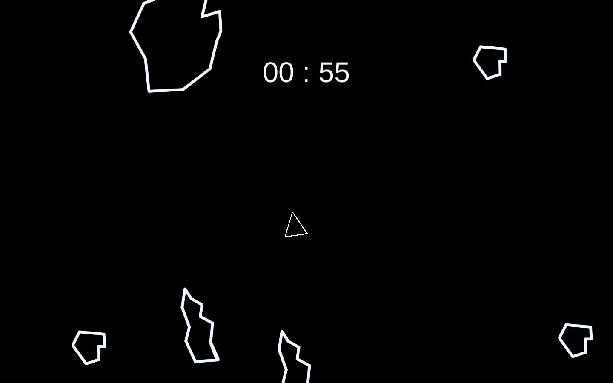

# Asteroids
Simple Asteroids game clone. I used these courses :  
[C# Programming for Unity Game Development Specialization](https://www.coursera.org/specializations/programming-unity-game-development)

## How to run the game
Just open Index.html, it is in Build folder.

## Controls
* Space - make ship move forward
* Left/Right - rotate ship
* Shift/Ctrl - shoot
